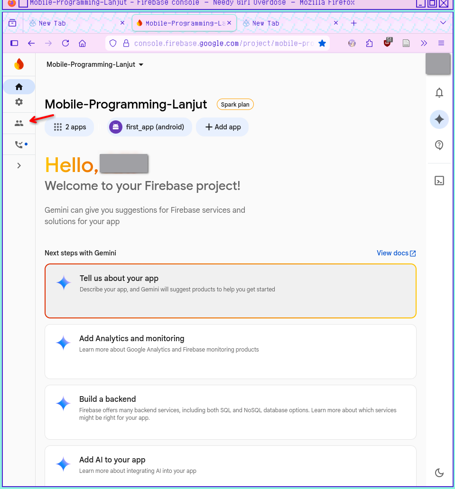
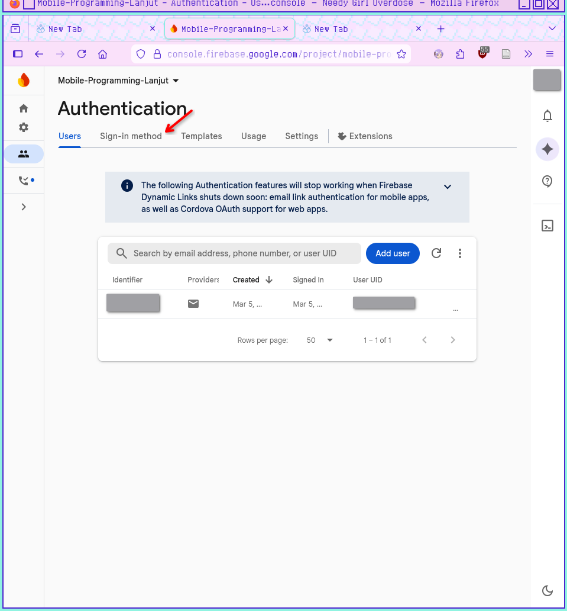
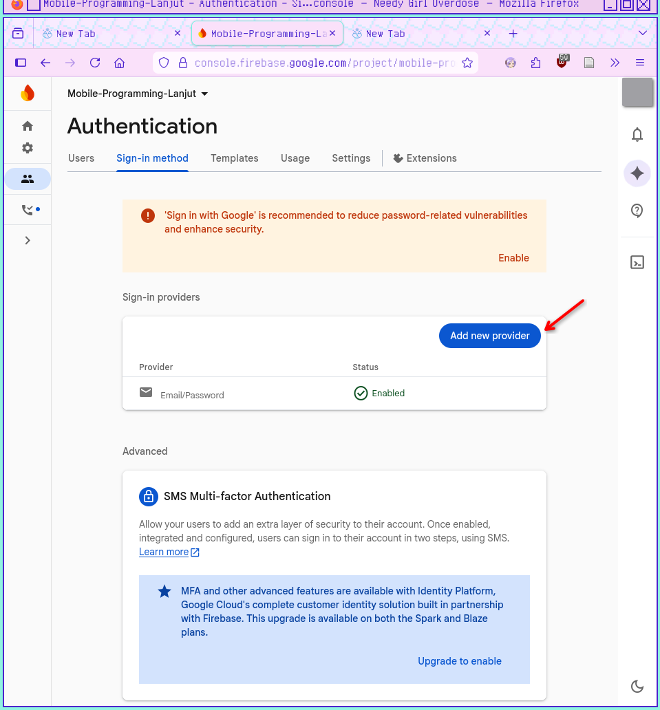

## Firebase Setup for Flutter

### 1. Prerequisites

* Install [Node.js](https://nodejs.org/) (required for Firebase CLI).
* Create a project in the [Firebase Console](https://console.firebase.google.com/).


### 2. Tooling Installation

Open your terminal and run the following:

* **Install Firebase CLI:**
```bash
npm install -g firebase-tools

```


* **Log in to Google:**
```bash
firebase login

```


* **Activate FlutterFire CLI:**
```bash
dart pub global activate flutterfire_cli

```


### 3. Project Configuration

Run this command at the **root** of your Flutter project:

```bash
flutterfire configure

```

> **Note:** This command will ask you to select your Firebase project and platforms (iOS, Android, Web). It automatically generates `lib/firebase_options.dart`.

### 4. Flutter Integration

Add the core dependency to your project:

```bash
flutter pub add firebase_core

```

### 5. Initialize Firebase

Update your `lib/main.dart` to initialize the app:

```dart
import 'package:firebase_core/firebase_core.dart';
import 'firebase_options.dart'; // Generated by flutterfire configure

void main() async {
  WidgetsFlutterBinding.ensureInitialized();
  await Firebase.initializeApp(
    options: DefaultFirebaseOptions.currentPlatform,
  );
  runApp(const MyApp());
}

```

Important: Enable Email/Password in Firebase Console

Even with perfect code, Firebase will reject your request unless you "turn on the switch" in their dashboard.

   1. Go to the Firebase Console.
   2. Select your project.
   3. On the left sidebar, click Authentication.    
   4. Click the Sign-in method tab.    
   5. Click Email/Password and set it to Enabled.    
   6. Save.
